# B-Tree Insertion Step-by-Step Notes

## Initial Parameters

* **Order ($m$):** 4


* **Max Keys Allowed:** $m - 1 = 3$

* **Min Keys Allowed:** $\lceil m/2 \rceil - 1 = 1$

* **Min Children Allowed:** $\lceil m/2 \rceil = 2$

* **Split Bias:** Left Biased (When splitting `[A, B, C, D]`, the median is the 3rd key `C`. The left node keeps more keys).


**Elements to Insert:** 5, 3, 21, 9, 13, 22, 7, 10, 11, 14, 8, 16

---

### Step 1: Inserting 5

The tree starts with a single element in a single node.

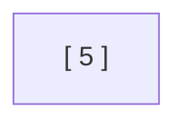

### Step 2: Inserting 3

The key is inserted into the leaf node in sorted order.

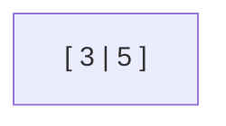

### Step 3: Inserting 21

The key is inserted into the leaf node in sorted order.

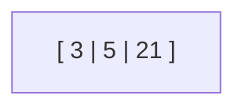

### Step 4: Inserting 9

The key is added to the leaf, creating a temporary state of `[3, 5, 9, 21]`.

> **Note from solution:** Keys have exceeded the max limit, so we split the node & move the median upwards. Median of 3, 5, 9, 21 can be 5 or 9. Choosing to be **left biased**, meaning left nodes will have more keys, the median is **9**.
> 
> 

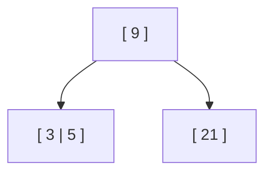

---

### Step 5: Insert 13

Since $13 > 9$, it routes to the right leaf node.

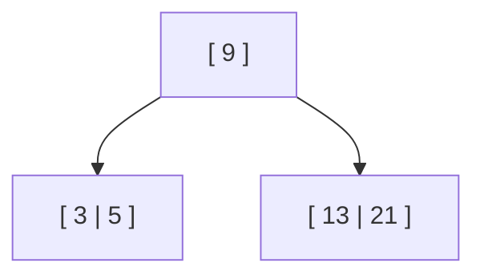

---

### Step 6: Insert 22

Since $22 > 9$, it routes to the right leaf node in sorted order.

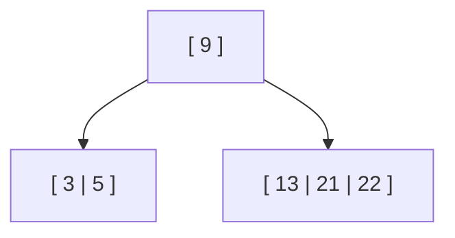

---

### Step 7: Insert 7

Since $7 < 9$, it routes to the left leaf node in sorted order.

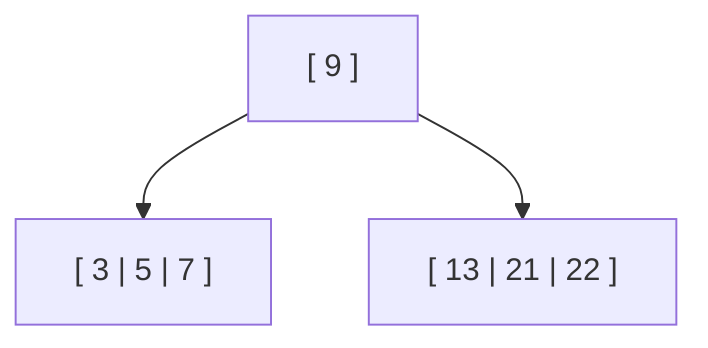

---

### Step 8: Insert 10

Since $10 > 9$, it goes to the right leaf node, creating a temporary overflow of `[10, 13, 21, 22]`.

> **Note from solution:** Has exceeded the max key limit. Split. The left-biased median **21** is shifted upwards to the parent node.
> 
> 

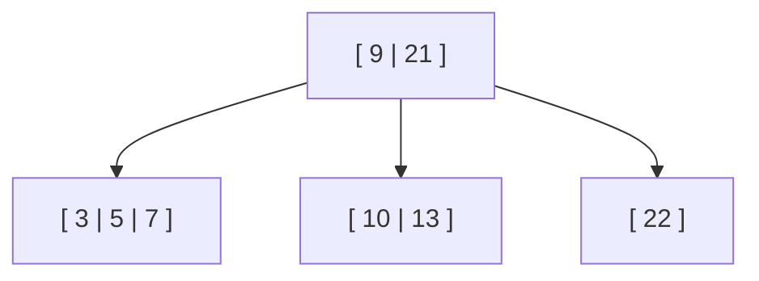

---

### Step 9: Insert 11

Since $9 < 11 < 21$, it routes into the middle leaf node in sorted order.

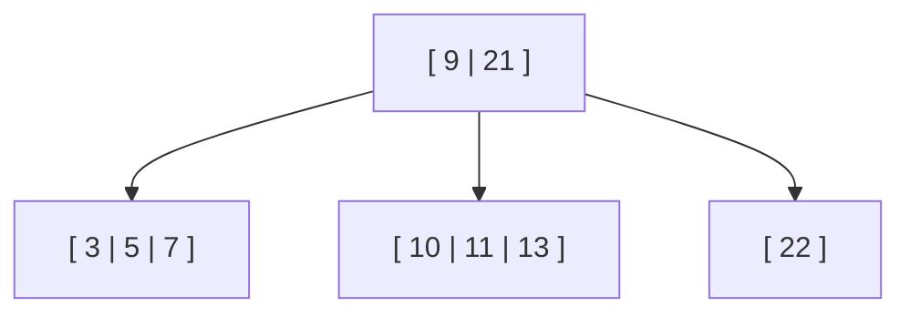

---

### Step 10: Insert 14

Since $9 < 14 < 21$, it routes to the middle leaf node, causing a temporary overflow of `[10, 11, 13, 14]`. The left-biased median **13** is pushed up into the root node.

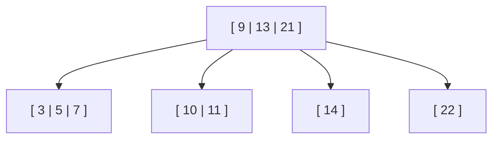

---

### Step 11: Insert 8

Since $8 < 9$, it routes to the leftmost leaf node, creating a temporary overflow of `[3, 5, 7, 8]`.

The left-biased median **7** is sent up to the parent node. This causes a **cascading overflow** because the parent node now becomes `[7, 9, 13, 21]`.

> **Note from solution:** When we sent 7 to the parent node, the parent node also overflowed. So, we split the parent node as well. The median **13** is shifted upwards to become a new root.
> 
> 

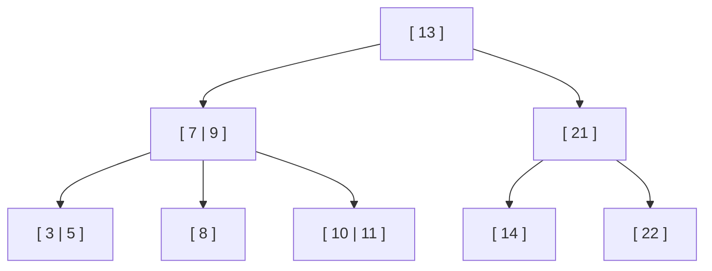

---

### Step 12: Insert 16

Since $16 > 13$ and $16 < 21$, it routes through the right internal node down into the leaf node containing 14, updating it to `[14, 16]`.

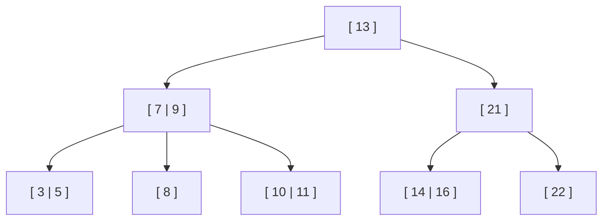


# B-Tree Deletion Step-by-Step Notes (Order $m = 5$)

These digital notes document the B-tree deletion cases, scenarios, and resolution strategies from your study guide[cite: 2].

---

## 1. Core Configuration & Structural Rules
Based on an **Order ($m$) = 5** B-tree, the following mathematical parameters apply to every node[cite: 2]:
*   **Max Keys Allowed:** $m - 1 = 4$ keys[cite: 2]
*   **Min Keys Allowed:** $\lceil m/2 \rceil - 1 = \lceil 5/2 \rceil - 1 = 2$ keys (except the root)[cite: 2]

---

## Case 1: The Key to be Deleted is in a Leaf Node

### Scenario 1: Leaf Node Has Extra Keys (More than Minimum)
If the leaf node containing the target key has more than the minimum number of keys allowed (more than 2), simply delete the key[cite: 2]. No structural rebalancing is required[cite: 2].

#### Example: Delete 39
*   **Before:** The target leaf node `[38, 39, 40]` contains 3 keys, which is above the minimum limit of 2[cite: 2].

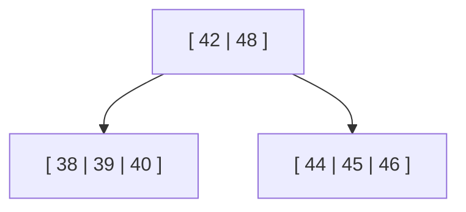

* **After Deletion:** Removing 39 leaves the node with `[38, 40]`. Since it still satisfies the minimum requirement of 2 keys, the tree remains valid.


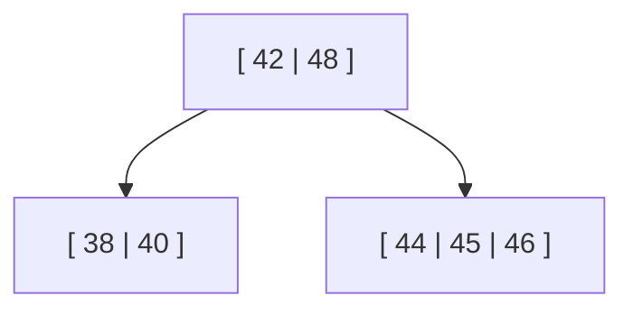

---

### Scenario 2: Leaf Node is at Minimum Capacity (Borrowing from Siblings)

If deleting a key causes the node to fall below the minimum capacity (fewer than 2 keys), look at the immediate left or right sibling. If a sibling has extra keys, borrow one via a parent rotation/swap.

#### Example: Delete 16

* **Before:** The target leaf node is `[16, 18]`. Both siblings have extra keys (`[10, 12, 14]` and `[21, 22, 24]`).


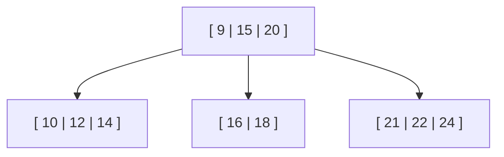

* **Rotation Execution:** Deleting 16 leaves the node deficient with just `[18]`. Deciding to borrow from the right sibling, take its smallest key (**21**) and swap it into the parent separator position, pulling the old parent separator (**20**) down into the deficient leaf.


* **After Deletion:** The separator is updated correctly, and all nodes satisfy the minimum key requirements.


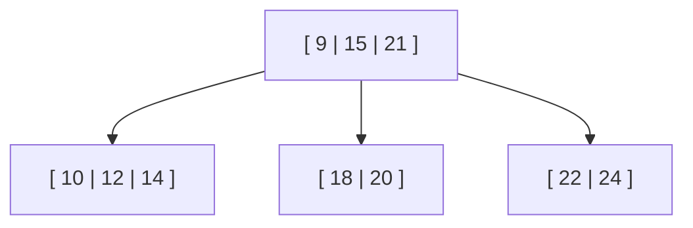

---

### Scenario 3: Leaf Node and Siblings are all at Minimum Capacity (Merging Nodes)

When a node underflows upon deletion and none of its immediate siblings have extra keys to lend, borrowing is impossible. The deficient node must be merged with a sibling and their shared parent separator key.

#### Example: Delete 22

* **Before:** The target node is `[22, 24]`. Its left sibling `[18, 20]` is at the absolute minimum of 2 keys and cannot spare any.


* **Merge Execution:** Deleting 22 leaves the node with just `[24]`. Combine the current node `[24]`, its sibling `[18, 20]`, and the parent separator **21** into a single combined node.


* **After Deletion:** The elements combine into `[18, 20, 21, 24]`.


> **Note on Safety:** $(\text{Minimum keys: } 2) + (\text{Underflowed keys: } 1) + (\text{Parent key: } 1) = 4\text{ keys}$. This matches the maximum limit ($m-1 = 4$), ensuring the merged node will never overflow.
> 
> 


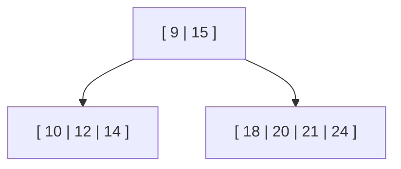

(Note: If pulling the separator down leaves the parent node with less than the minimum number of keys, apply this same merging technique recursively upwards.)

---

## Case 2: The Key to be Deleted is in an Internal Node

You cannot directly erase a key from an internal node because it acts as a routing separator for its left and right subtrees. It must be replaced by a valid new separator:

1. The **largest value in its left subtree** (Inorder Predecessor), **OR**
2. The **smallest value in its right subtree** (Inorder Successor).


#### Example: Delete 28

* **Before:** Key 28 is located inside an internal node and divides the subtrees `[26, 27]` and `[30, 32]`.


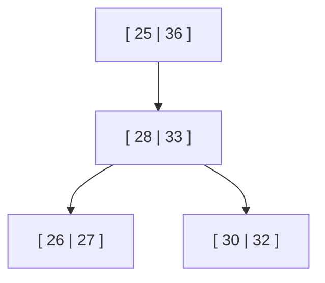

* **Substitution Execution:** Choose the smallest value in the right subtree (**30**) to replace 28.


* **After Deletion State:** Key 30 is moved up into the internal node. However, this leaves the bottom leaf node with only a single key `[32]`, which violates the minimum key constraint. To finish balancing the tree, you now apply the standard leaf level underflow mechanics (borrowing or merging) to fix `[32]`.


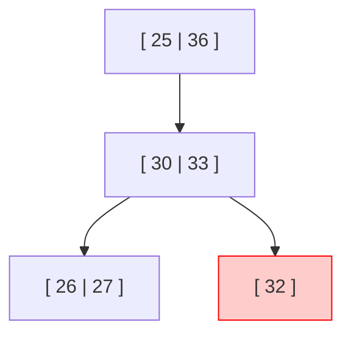

```

```
