# B-Tree Insertion Step-by-Step Notes

## Initial Parameters

* **Order ($m$):** 4

* **Max Keys Allowed:** $m - 1 = 3$

* **Min Keys Allowed:** $\lceil m/2 \rceil - 1 = 1$

* **Min Children Allowed:** $\lceil m/2 \rceil = 2$

* **Split Bias:** Left Biased (When splitting `[A, B, C, D]`, the median is the 3rd key `C`. The left node keeps more keys).

**Elements to Insert:** 5, 3, 21, 9, 13, 22, 7, 10, 11, 14, 8, 16

---

### Step 1: Inserting 5

The tree starts with a single element in a single node.

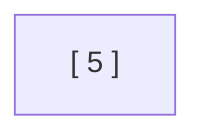

### Step 2: Inserting 3

The key is inserted into the leaf node in sorted order.

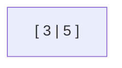

### Step 3: Inserting 21

The key is inserted into the leaf node in sorted order.

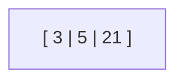

### Step 4: Inserting 9

The key is added to the leaf, creating a temporary state of `[3, 5, 9, 21]`.

> **Note from solution:** Keys have exceeded the max limit, so we split the node & move the median upwards. Median of 3, 5, 9, 21 can be 5 or 9. Choosing to be **left biased**, meaning left nodes will have more keys, the median is **9**.
> 
> 

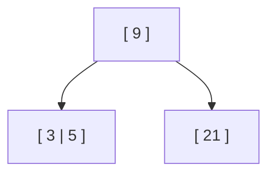

---

### Step 5: Insert 13

Since $13 > 9$, it routes to the right leaf node.

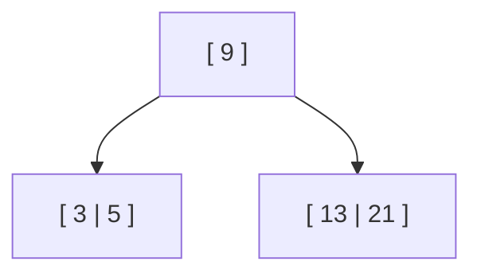

---

### Step 6: Insert 22

Since $22 > 9$, it routes to the right leaf node in sorted order.

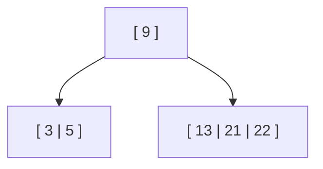

---

### Step 7: Insert 7

Since $7 < 9$, it routes to the left leaf node in sorted order.

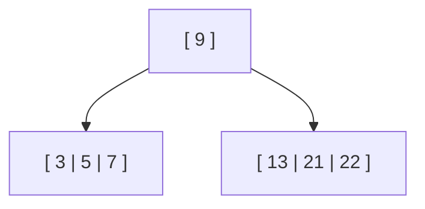

---

### Step 8: Insert 10

Since $10 > 9$, it goes to the right leaf node, creating a temporary overflow of `[10, 13, 21, 22]`.

> **Note from solution:** Has exceeded the max key limit. Split. The left-biased median **21** is shifted upwards to the parent node.
> 
> 

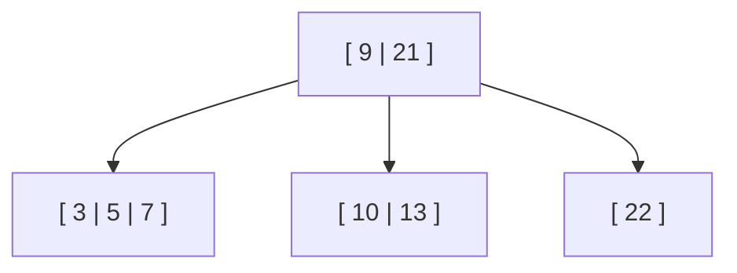

---

### Step 9: Insert 11

Since $9 < 11 < 21$, it routes into the middle leaf node in sorted order.

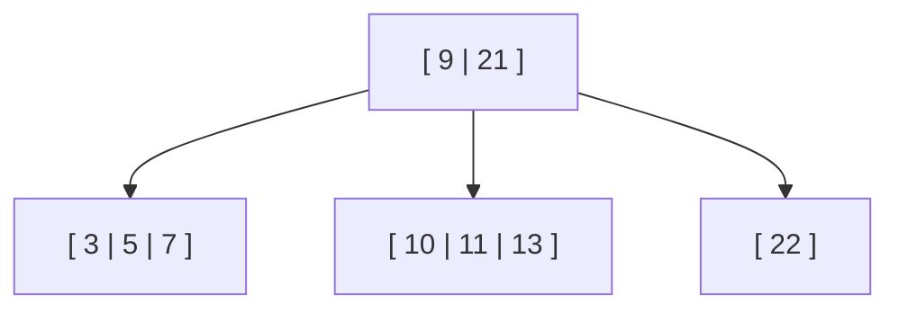

---

### Step 10: Insert 14

Since $9 < 14 < 21$, it routes to the middle leaf node, causing a temporary overflow of `[10, 11, 13, 14]`. The left-biased median **13** is pushed up into the root node.

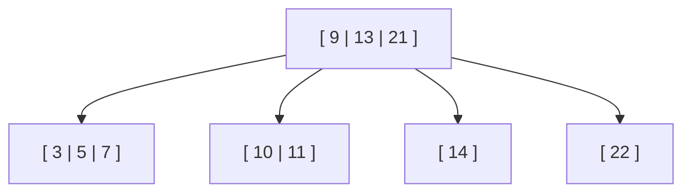

---

### Step 11: Insert 8

Since $8 < 9$, it routes to the leftmost leaf node, creating a temporary overflow of `[3, 5, 7, 8]`.

The left-biased median **7** is sent up to the parent node. This causes a **cascading overflow** because the parent node now becomes `[7, 9, 13, 21]`.

> **Note from solution:** When we sent 7 to the parent node, the parent node also overflowed. So, we split the parent node as well. The median **13** is shifted upwards to become a new root.
> 
> 

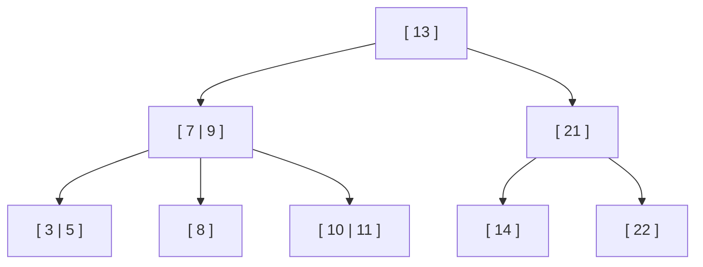

---

### Step 12: Insert 16

Since $16 > 13$ and $16 < 21$, it routes through the right internal node down into the leaf node containing 14, updating it to `[14, 16]`.

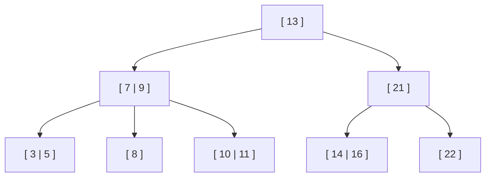
