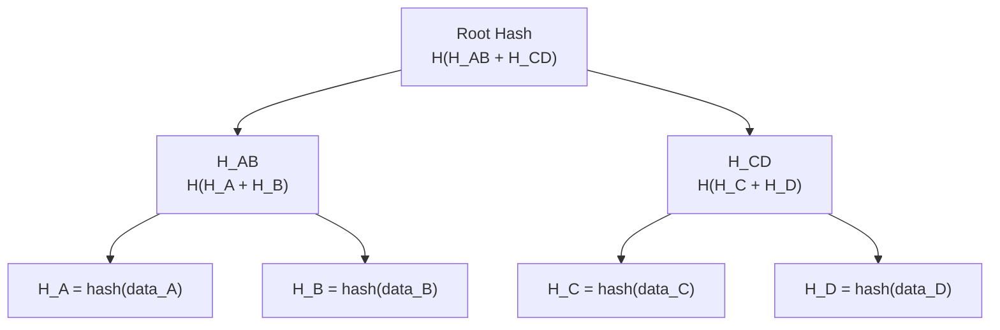
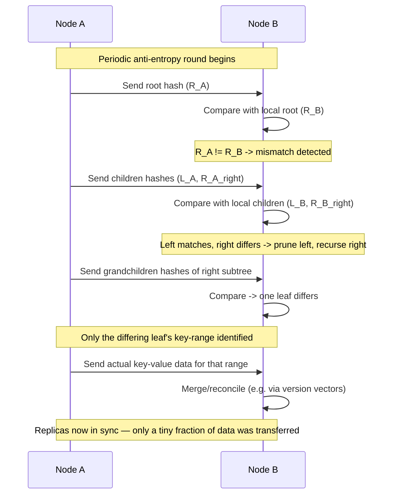
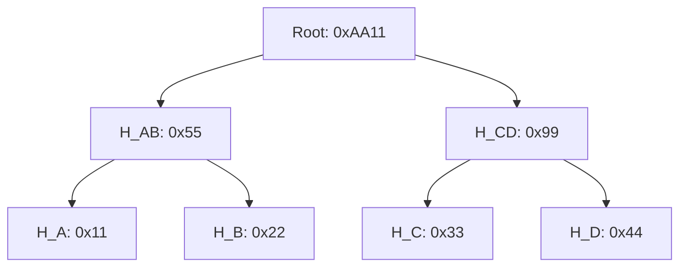
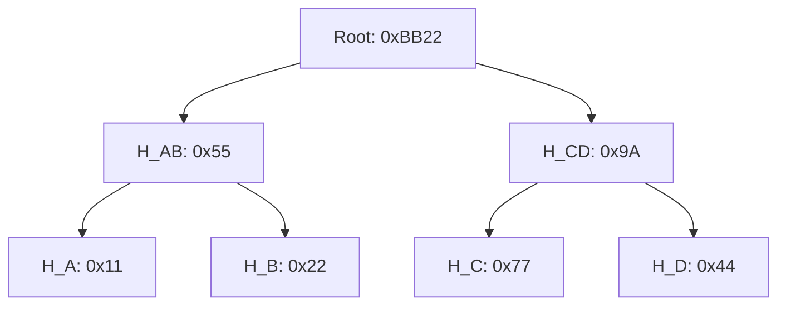

# Merkle Trees

## 1. The Problem It Solves

Two replicas (or two copies of data anywhere) need to figure out **whether they're in sync**, and if not, **exactly which keys differ** — without transferring the entire dataset over the network.

Naive approaches and why they fail at scale:

| Approach | Problem |
|---|---|
| Compare every key-value pair | O(n) network transfer, way too expensive for large datasets |
| Single hash of entire dataset | Tells you *if* they differ, but not *where*. One mismatch anywhere forces a full re-sync |
| Hash each key individually, compare all | O(n) comparisons — same cost as comparing raw data |

**Merkle tree** gives you a way to find the differing keys in **O(log n)** comparisons instead of O(n).

---

## 2. Structure

A Merkle tree is a **binary tree of hashes**:

- **Leaf nodes**: hash of an individual data block (e.g., hash of a key's value, or hash of a small key-range)
- **Internal nodes**: hash of the concatenation of their two children's hashes
- **Root**: a single hash that represents the entire dataset

If even one byte of one leaf changes, that change **propagates all the way up** to the root, changing the root hash.

**Key property**: comparing two trees top-down means you only descend into subtrees whose hashes actually differ. Matching subtrees are pruned immediately — you never look at their contents.

---

## 3. Construction Cost

- Building: O(n) to hash all leaves + O(n) to build internal nodes (still linear, done once, done locally, not over the network)
- Comparing two trees: **O(log n)** hash comparisons in the best case (few differences), degrades toward O(n) only if *everything* differs
- Storage overhead: roughly one extra hash per data block (leaf) plus internal nodes — typically a small fraction of the dataset

The whole point: **construction and hashing are local and cheap; what's expensive is network transfer, and that's exactly what Merkle trees minimize.**

---

## 4. Core Application: Anti-Entropy in Distributed Databases

This is the classic system design usage — seen in **Dynamo, Cassandra, Riak** for leaderless/eventually-consistent replication.

### Why anti-entropy exists

In a leaderless system (quorum reads/writes), replicas can drift out of sync due to:
- A node being down during a write (missed write)
- Network partitions
- Hinted handoff not being delivered/expired

**Read repair** fixes drift *reactively* — only for keys that happen to get read. **Anti-entropy** fixes drift *proactively* — a background process that continuously reconciles replicas even for cold/rarely-read keys.

### How it works, step by step

**Setup**: Each node owns a range of keys (via consistent hashing). For each key range it's responsible for, a node maintains a Merkle tree over that range.

**Step 1 — Build/refresh trees**
Each replica independently builds a Merkle tree over its key range. Leaves are typically hashes of small sub-ranges of keys (not one leaf per key — that's too fine-grained), internal nodes hash pairs of children up to a root.

**Step 2 — Exchange root hashes**
Node A sends its root hash to Node B (or vice versa, during a periodic gossip round).

**Step 3 — Compare**
- If roots match → the entire key range is in sync. Done. Zero data transferred.
- If roots differ → something in the range differs. Descend one level.

**Step 4 — Recurse**
Compare children hashes level by level. At each level, discard (prune) branches where hashes match; recurse only into branches where they don't.

**Step 5 — Reach leaves**
Eventually you reach leaf nodes whose hashes differ — these correspond to the actual small key ranges that are out of sync.

**Step 6 — Repair**
Only for those specific leaf ranges, the nodes exchange actual key-value data (typically resolved via vector clocks / version vectors / last-write-wins, whatever the conflict resolution scheme is) and reconcile.

### Sequence diagram

---

## 5. Worked Example

Say Node A and Node B each own the same key range, split into 4 leaf buckets: `[A, B, C, D]`.

Only bucket `C`'s data differs between the two nodes (say, a write to a key in that bucket didn't reach Node B).

**Node A's tree:**

**Node B's tree (bucket C differs):**

**Comparison trace:**

1. Compare roots: `0xAA11` vs `0xBB22` → **mismatch**. Descend.
2. Compare `H_AB`: `0x55` vs `0x55` → **match!** Prune entire left subtree — buckets A and B are confirmed in sync, no need to even look at them.
3. Compare `H_CD`: `0x99` vs `0x9A` → **mismatch**. Descend.
4. Compare `H_C`: `0x33` vs `0x77` → **mismatch**. This is a leaf — found it.
5. Compare `H_D`: `0x44` vs `0x44` → **match**. Bucket D is fine.
6. Only bucket **C** is flagged as divergent. A and B exchange the actual data in bucket C, reconcile (e.g., B pulls A's version, or both merge via version vectors if concurrent), and update their trees.

**Result**: with 4 buckets you found the 1 differing bucket in 3 hash comparisons instead of comparing all the raw data in all 4 buckets. At scale (millions of keys), this ratio is what makes anti-entropy feasible.

---

## 6. Other Applications (good to mention if asked "where else")

- **Git**: every commit/tree/blob is content-addressed by hash; comparing two commit trees to find changed files is exactly this pruning technique
- **Blockchain (Bitcoin)**: transactions in a block are Merkle-tree-hashed; lets a lightweight client (SPV) verify a transaction is included in a block using a small Merkle proof (path of ~log n hashes) instead of downloading the whole block
- **IPFS / content-addressed storage**: data chunks form a Merkle DAG; identical content across files/versions is automatically deduplicated because identical subtrees hash identically
- **Certificate Transparency logs**: append-only Merkle trees let auditors verify a certificate was logged without downloading the whole log
- **rsync-like file sync tools**: similar idea — chunk hashing to transfer only diffs

---

## 7. Merkle Trees vs. Alternatives — Interview Talking Points

| Technique | Detects mismatch? | Localizes mismatch? | Cost to compare |
|---|---|---|---|
| Full data comparison | Yes | Yes | O(n) transfer |
| Single whole-dataset hash | Yes | No | O(1) but useless for repair |
| Merkle tree | Yes | Yes, down to leaf granularity | O(log n) typical |

**Trade-offs / limitations to mention:**
- Leaf granularity is a tuning knob: too fine (1 leaf per key) → huge tree, storage/build overhead; too coarse → a single-key mismatch forces re-transfer of a larger bucket than necessary
- Trees need to be **rebuilt/updated** as data changes — if done naively this can be expensive; some systems rebuild periodically rather than on every write (Cassandra builds Merkle trees on-demand during a repair, not maintained continuously)
- Doesn't tell you *which side* is correct — that's a separate conflict-resolution concern (vector clocks, LWW, CRDTs)
- Two nodes must partition their key space **identically** (same bucket boundaries) for leaf comparison to make sense

---

## 8. One-Line Answer If Asked "What Is It and Why"

> A Merkle tree is a hash tree where each leaf hashes a data block and each internal node hashes its children, letting two datasets be compared in O(log n) by recursively pruning matching subtrees — used in anti-entropy repair (Dynamo/Cassandra) to find and fix replica drift while transferring only the divergent data.
